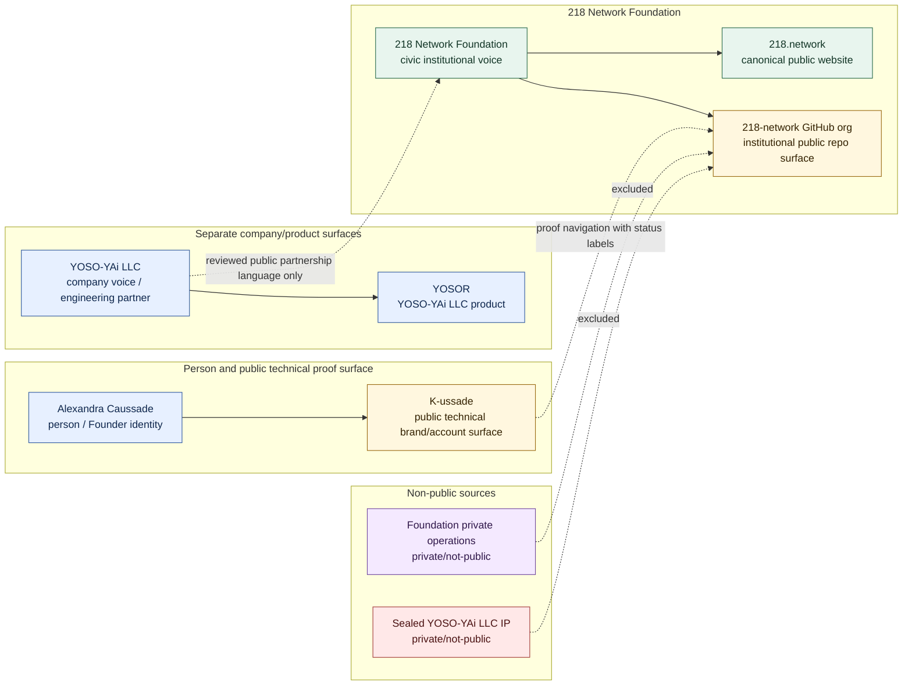

# Organization Surface Map

## Purpose

This graph separates the Foundation institutional public surface from Alexandra Caussade, K-ussade, YOSO-YAi LLC, YOSOR, private operations, and release surfaces.

## Mermaid Diagram

## Interpretation Notes

- The GitHub org is institutional Foundation infrastructure, not K-ussade and not a company namespace.
- K-ussade can point to the org as public proof navigation, but it does not speak as the institution.
- YOSO-YAi LLC and YOSOR are separate boundary references only.

## Boundary Notes

- Private operations and sealed company IP are excluded from public GitHub.
- Public repo publication does not imply live deployments, reports, schools, NEURONAs, datasets, models, or Spaces.

## Follow-Up Actions

- Keep the org profile and repo index synchronized after every repo status change.
- Add new institutional repos only after boundary and status review.
