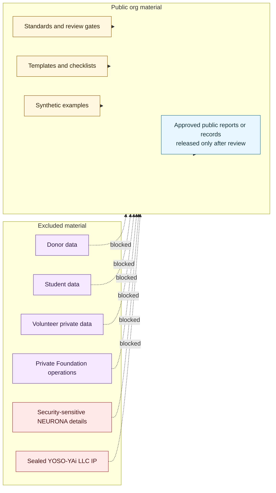

# Public Private Boundary Map

## Purpose

This graph maps what can enter the public org and what remains private/not-public.

## Mermaid Diagram

## Interpretation Notes

- The public org is safe for standards, templates, synthetic examples, and reviewed released artifacts.
- Sensitive categories are blocked from the public org regardless of repo visibility.

## Boundary Notes

- Examples inherit input boundaries and must be synthetic unless explicitly approved.
- Hugging Face is release-only and not a sealed development home.

## Follow-Up Actions

- Re-run validation before every push.
- Add a review note before any real report or real governance artifact is introduced.
