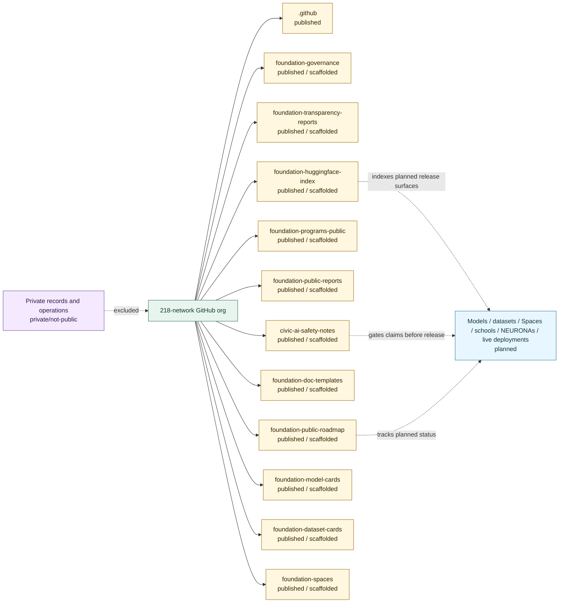

# Repo Status Map

## Purpose

This graph records the institutional repos and their public statuses.

## Mermaid Diagram

## Interpretation Notes

- The public stack is published and scaffolded.
- The second stack adds release-index, documentation-template, safety-note, model-card, dataset-card, and Space-readiness scaffolds.
- The roadmap and Hugging Face index track planned future artifacts without converting them into released artifacts.

## Boundary Notes

- `published` means reachable repo, not live operations.
- `private/not-public` material is not indexed as public proof.

## Follow-Up Actions

- Update this graph when repository status changes.
- Add an audit entry before moving any repo from `scaffolded` to `released` artifact support.
